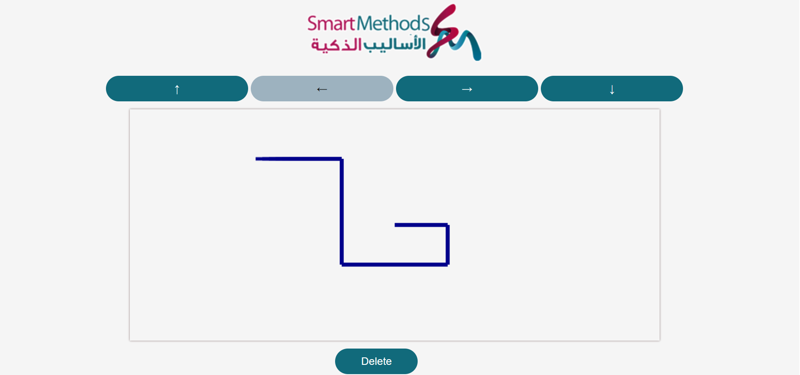

# robotmap
**This tasks is a part of the summer training at the Smart Methods Company.**
--------------------------------------
**Task 2:**
--------------------------------------
"maprobot" this code represent to control the Robot's movements in directions (forward,backward,left,right).When the button is clicked it draw path line then store a value in php .
--------------------------------------

